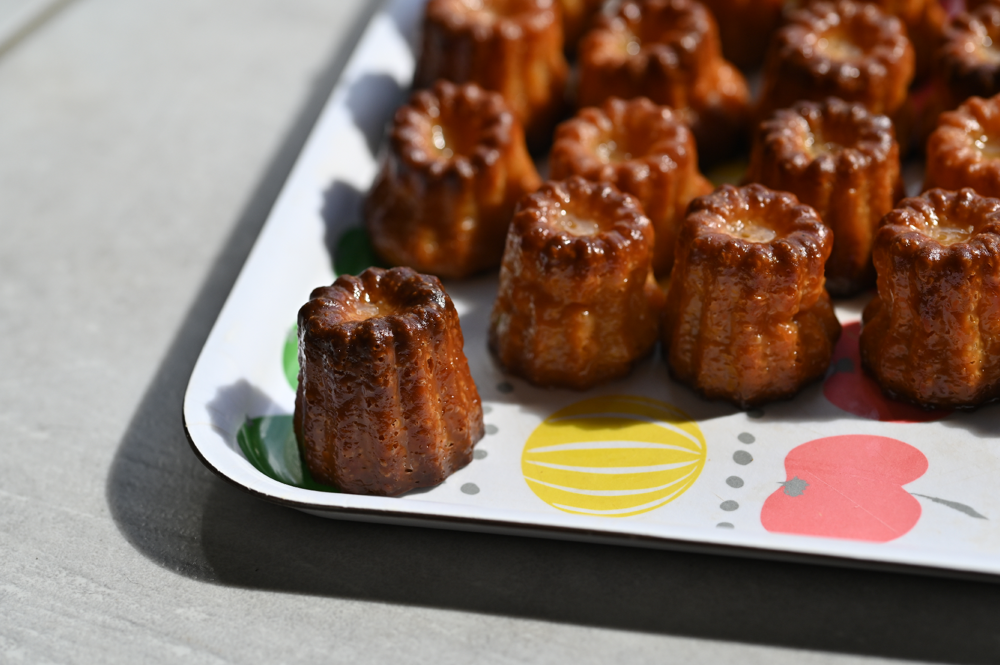
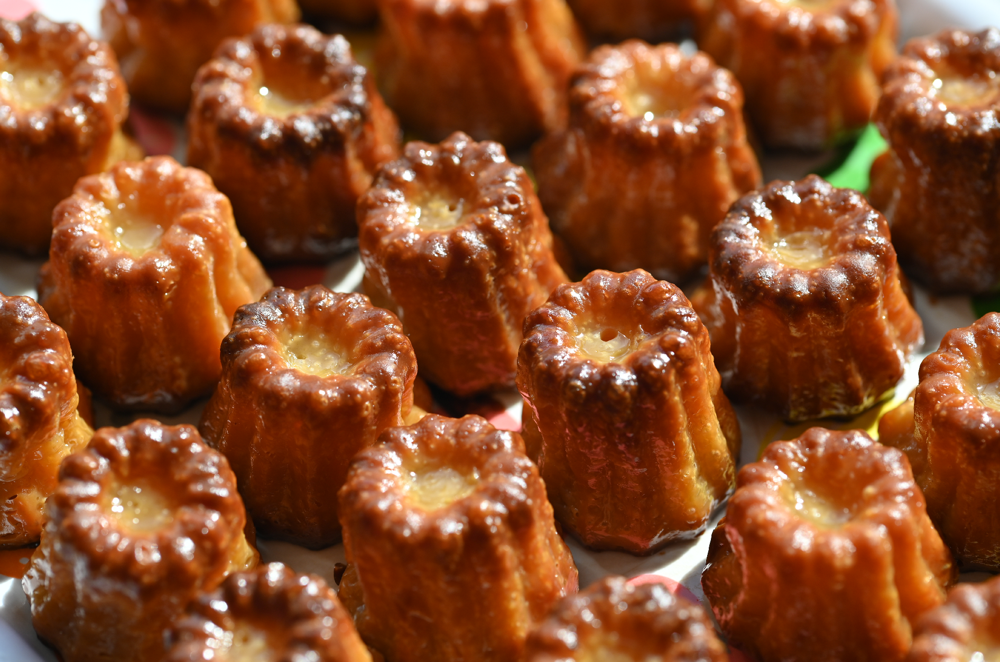
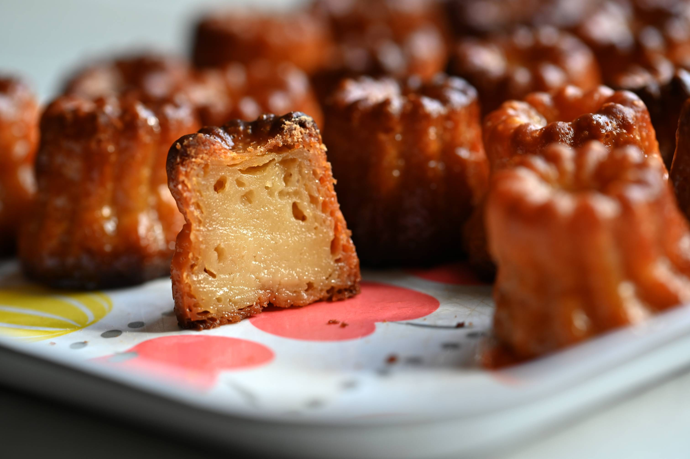

I've made some small-sized Canelés today. It's a traditional pastry for the Bordeaux region. They have strong rum and vanilla flavors, the outside slightly crusty and caramelized while the custardy inside stays soft and firm.

The recipe is quite simple but the cooking process requires a bit of experimentation to get just right. Traditionally, they should be cooked in copper molds, which help spread the heat uniformly on the surface of the pastry. Here at home, I'm using silicone molds. So to get this darker crust, I cook them in the molds until the exposed part turn golden brown, unmold them and finish cooking them upright in an improvised bain-marie (so that the bottom part doesn't burn on the baking tray).

And now recipe time!

## Ingredients

- 500ml milk
- 50g butter
- 250g brown sugar
- 125g all-purpose flour
- 2 whole eggs + 2 egg yolks
- 75ml dark rum
- Some vanilla extract (or actual vanilla pod if available)

## Steps

1. Put the milk, half of the sugar (125g), the vanilla extract, and the butter (50g) in a saucepan. Let the temperature slowly rise to roughly 60°C and stir from time to time.
2. In a big bowl, put the flour (125g) and the rest of the sugar (125g). Mix together and make a well in the centre.
3. Beat the 2 whole eggs and 2 egg yolks in another bowl.
4. When the milk in the saucepan reach 60°C, stop the heat, place the beaten eggs in the well, and pour about 1/3 of the hot milk in the well. Gently mix until homogenized.
5. Continue to pour the rest of the hot milk while gently mixing. Stop when the mixture is homogenized.
6. When the temperature drops to around 30°C, pour the rum (75ml), gently mix once again.
7. Let it cool down completely and then place in the fridge for roughly 24 hours
8. The next day, preheat your convection (aka fan-assisted) oven to 240°C.
9. Gently mix one last time to homogenize.
10. Butter the molds (oil is fine too), place them on a tray and pour the mixture in the molds.
11. When the oven has reached 240°C, place the tray in the middle of the oven for 8 minutes.
12. After 8 minutes, without opening the oven, turn down the temperature to 180°C and continue baking for another 50 minutes.
13. Meanwhile, prepare a bain-marie (water bath). Place a small deep baking tray inside another deep tray. Fill the larger tray with water until to smaller one starts floating.
14. Optional: mid baking, turn the tray 180° if your oven is prone to irregular baking (hotter and colder spots)
15. After 50 minutes (or until the visible part of the pastries turn to a dark golden color), remove them from the oven, unmold them and place them in the floating deep tray. The lesser cooked part of the Canelés (the part that wasn't visible when in the molds) should be facing up.
16. Place the bain-marie in the middle of the convection oven. Turn up the heat to 220°C.
17. Continue cooking until the outside takes a nice uniform dark golden color. If the inner deep tray stops floating, pour some extra water until it floats again.
18. Remove from the oven, let them completely cool before eating.
19. Enjoy!

## Gallery

